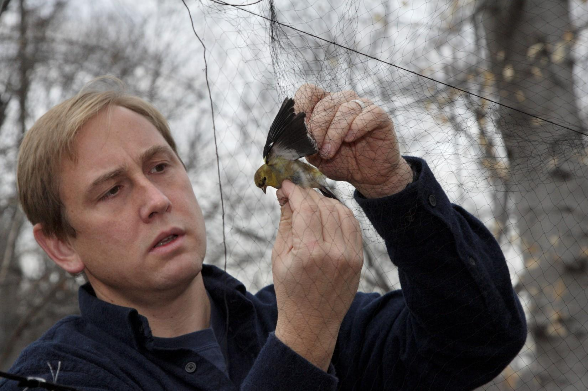

<style type="text/css">

body{ /* Normal  */
   font-size: 20px;
}

h1 { /* Header 1 */
 font-size: 32px;
 color: DarkBlue;
}

h3 { /* Header 1 */
 font-size: 26px;
}

</style>

# NZP BANDING: CONCEPT OF OPERATIONS
<hr>
### Phase I: Pilot program for bird banding operations at NZP

**Effective Dates**: 12/01/2016 – 1/27/2017

**Goals**: This phase of the project will test the banding component of what will become the demonstration banding program for the general public held on zoo grounds. Here, we seek to set up potential net lanes and execute banding operations to evaluate:  

1.	Catch rates by time and the general efficacy of selected nets
2.	How zoo staff and volunteers respond to banding activity
3.	How the general public responds to banding activity  


**Description of activity**:
Banding operations will occur on Thursdays and Fridays of each week, weather permitting. We will not band during measurable precipitation events, during windy conditions (>4 on the Beaufort Scale, gusts of >19 miles per hour), or at temperatures below 0&deg;C (see Bander's Code of Ethics at [this link](https://www.pwrc.usgs.gov/BBl/resources/ethics.cfm)). During each banding day, 10-20 mist nets will be set up throughout the zoo grounds and will be open for roughly 6 hours per day (see below). Mist nets are 12 m long (some are 6 m) and are fastened at each end to aluminum conduit (height = 3 m).  Potter traps (see [this link](http://www.powdermillarc.org/highlights/2013/winter.aspx) for an example of a potter trap) may be used in conjunction with netting efforts in publically inaccessible locations and at feeding stations. All nets visible from the path will have a sign warning onlookers that it is illegal to touch the net for any reason (go to [this link](https://github.com/bsevansunc/birdCats/blob/master/smbc/zooBandingSign.png) to view or download the sign). It is prohibited for any individual (general public, volunteers, SMBC/NZP staff) to attempt to extract birds from the net without the express permission of the project coordinator (Brian Evans, EvansBr@si.edu, 919-723-7907). Birds will be extracted during “net runs” (i.e., a circuit walked to check nets for captured birds), with nets checked every 30 minutes. A bird caught in net will be placed in a cloth bag and brought to a central location where it will be aged, sexed, measured (e.g., wing chord), banded with color bands and a USGS Aluminum band, and released.  

**Equipment needs**: The full banding equipment list is provided on a spreadsheet available at [this link](https://docs.google.com/spreadsheets/d/1lZfYova52vUKNAccVP1Yd8WZyTrK8EciHt9YnLnjn2U/edit#gid=0). We are requesting additional equipment for communication with the public, including: uniforms for SMBC/NZP staff and name tags for SMBC/NZP staff and volunteers. Additionally, we currently are maintaining three bird feeders on the grounds of the Science Building and request to place more feeders on zoo grounds to maximize catch rates. Finally, because some "net runs"" (i.e., a circuit walked to check nets for captured birds) may be considerably long, we would like to acquire a cart to drive between nets. If available, this cart will only be used before zoo grounds are open to the public.  

**Locations of activity**: The map below displays potential net and potential banding station locations. You may also use your smart phone to explore net and potential banding station locations in Google Maps using [this link](https://www.google.com/maps/d/edit?hl=en&mid=1dUpGaxB929TXEXI-2Nt5hx64hu4&ll=38.92919658440485%2C-77.05010128836057&z=17). Net locations and banding stations are separated into upper (red) and lower (purple) zoo grounds. Each section will be sampled on a separate day (e.g., the upper zoo will be sampled on Thursdays and the lower zoo on Fridays). Smaller circles represent net locations and larger circles represent potential locations for the banding stations. 

```{r, include=FALSE }
library(dplyr) ; library(ggplot2) ; library(leaflet)

kmlPath <- "/Users/bsevans/Downloads/netLanes_upperZoo.kml"

kmlToDf <- function(kmlPath){
  require(plyr) ; require(maptools)
  getKMLcoordinates(kmlfile=kmlPath, ignoreAltitude=T) %>%
    ldply %>%
    dplyr::rename(lon = V1, lat = V2)
}

pointFrame <- bind_rows(
  kmlToDf('/Users/bsevans/Downloads/bandingStation_upperZoo.kml') %>%
    mutate(class = 'bandingStation',
           location = 'upper'),
  kmlToDf('/Users/bsevans/Downloads/bandingStation_lowerZoo.kml') %>%
    mutate(class = 'bandingStation',
           location = 'lower'),
  kmlToDf('/Users/bsevans/Downloads/netLanes_upperZoo.kml') %>%
    mutate(class = 'netLanes',
           location = 'upper'),
  kmlToDf('/Users/bsevans/Downloads/netLanes_lowerZoo.kml') %>%
    mutate(class = 'netLanes',
           location = 'lower')
  ) 

pal <- colorFactor(c("navy", "red"), domain = c("upper", "lower"))
```

```{r, echo = FALSE}
leaflet(data = pointFrame) %>%
  addTiles() %>%
  addCircleMarkers(
    ~lon, ~lat,
    radius = ~ifelse(class == "netLanes", 4, 8),
    color = ~pal(location),
    stroke = FALSE, 
    fillOpacity = ~ifelse(class == "netLanes", .9, .7)
    )
```

**Daily timeline for banding activities**: We will run the banding station for 6 hours per banding day. Because we want to have an estimate of catch rates at different times of day (e.g., to see if it would be feasible to do banding demonstrations to school groups in the afternoon), banding days will be run over the following scheduled time periods:  

MORNING BANDING: 

*	**0600-0615**: Preparatory meeting at the banding station (e.g., Amazonia, see map)  
*	**0615-0645**: SMBC/NZP staff and volunteers will set up the banding station and open nets  
*	**0645-1145**: All nets are open and checked every 30 minutes  
*	**1145-1215**: All nets are closed and removed. The banding station is taken down  
*	**1215-1230**: SMBC/NZP staff and volunteers gather to discuss the banding day (e.g., any difficulties encountered, lessons learned)  

MID-MORNING, EARLY AFTERNOON BANDING:

*	**0800-0815**: Preparatory meeting at the banding station (e.g., Amazonia, see map) 
*	**0815-0845**: SMBC/NZP staff and volunteers will set up the banding station and open nets
*	**0845-1345**: All nets are open and checked every 30 minutes 1
*	**1345-1415**: All nets are closed and removed. The banding station is taken down
*	**1415-1430**: SMBC/NZP staff and volunteers gather to discuss the banding day (e.g., any difficulties encountered, lessons learned) 

LATE-MORNING, AFTERNOON BANDING:

*	**1000-1015**: Preparatory meeting at the banding station (e.g., Amazonia, see map)
*	**1015-1045**: SMBC/NZP staff and volunteers will set up the banding station and open nets
*	**1045-1545**: All nets are open and checked every 30 minutes 1
*	**1545-1615**: All nets are closed and removed. The banding station is taken down
*	**1615-1630**: SMBC/NZP staff and volunteers gather to discuss the banding day (e.g., any difficulties encountered, lessons learned) 

**Staffing needs**: This phase of the project will require two SMBC/NZP staff members per banding day to assist with extracting birds from nets and banding.  

**Evaluation**: For each of the goals provided above, we will evaluate:

1.	Catch rates and the general efficacy of selected nets: Identify net locations that minimize the distance walked on a net run while maximizing our rates of capture and the diversity of birds caught. Staff and volunteers will use handheld GPS units to record the path and path distance during a net run. We will record the net location, species captures, and time of capture and evaluate species-specific capture rates by net location and time of day.
2.	Interaction with keepers and general volunteers throughout the zoo: TBD
3.	Interaction with the general public: TBD  

### Phase II:  Pilot program for training volunteers on bird banding activities

**Effective Dates**: 02/03/2017 – 04/28/2017

**Goal**: This phase of the project will evaluate the feasibility of training/utilizing volunteers for extraction of birds from nets. Catch rates and the general efficacy of selected nets will continue to be evaluated.

**Equipment needs**: As above. 

**Description of activity**: SMBC/NZP staff will conduct training of 4-6 volunteers or interns, each of whom are expected to volunteer one day per week. Volunteers and interns will be required to complete zoonosis training. Individuals may not interact with NZP collection bird s on the day of trapping. If volunteers work for the Bird House, they are not to wear the same clothing worn for trapping to the Bird House. If the predicted weather conditions do not allow for banding volunteers will be informed via email that their shift for that day has been cancelled. The timeline for training includes: 

* **Week 1**: Volunteers will observe extraction and processing of birds
* **Week 2**: Volunteers will observe processing of birds and learn to extract House Sparrows from nets under the guidance of SMBC/NZP staff
* **Week 3**: Under the guidance of SMBC/NZP staff, volunteers will learn to process birds and extract House Sparrows from nets
* **Weeks 4-7**: Volunteers will be allowed to extract House Sparrows without staff guidance. Under the guidance of SMBC/NZP staff, volunteers will learn to process birds and learn to extract other species from nets
* **Week 8**: The project manager will assess volunteer skill level. After this point, volunteers may require further extraction training or be allowed to extract birds on their own

**Staffing needs**: This phase of the project will require two SMBC/NZP staff members per banding day to assist with extracting birds from nets and banding. We will require 2-4 volunteers and/or interns per banding day. Volunteers will assist with data entry and will be trained on the extraction of birds during by SMBC/NZP staff. 

**Evaluation**: TBD

### Phase III: Pilot program for demonstration banding for the general public

**Effective Dates**: 05/04/2017 – 06/16/2017

**Goal**: This phase of the project will evaluate the efficacy of banding demonstrations given to the general public (i.e., zoo-goers not associated with a formal group).

**Equipment needs**: As above. 

 
**Description of activity**: SMBC/NZP staff will conduct demonstration banding activites at banding stations (see map above). 

**Staffing needs**: This phase of the project will require two SMBC/NZP staff members per banding day to assist with extracting birds from nets and banding. We will require 2-4 volunteers and/or interns per banding day.

**Evaluation**: TBD

### Phase IV: Pilot program for demonstration banding for the groups

**Effective Dates**: 06/22/2017 – 08/31/2017

**Goal**: This phase of the project will evaluate the efficacy of group banding demonstrations (e.g., FONZ classes).

**Equipment needs**: As above. 

**Description of activity**: SMBC/NZP staff will conduct demonstration banding activites at banding stations (see map above). 

**Staffing needs**: This phase of the project will require two SMBC/NZP staff members per banding day to assist with extracting birds from nets and banding. We will require 2-4 volunteers and/or interns per banding day. 

**Evaluation**: TBD

<hr>

 

